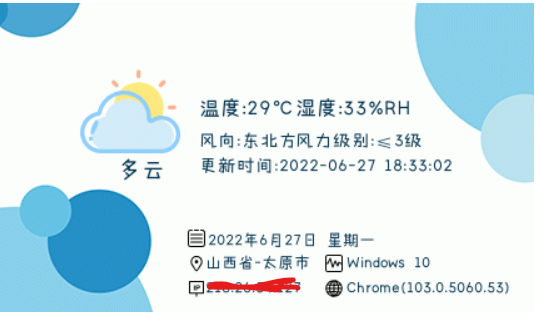

# IPCard

一款具有显示天气的IP签名档

#### 演示效果



#### 使用方法

把这个项目clone下来，上传到网站目录（需要PHP环境哦！）

把IP签名档添加到网站上，访客只需要打开你的网站就可以看到自己的IP，操作系统，浏览器，当地天气。

远程调用只需要将下面代码加到想显示的地方就行！比如网站侧栏/弹窗提醒等等...

```html

```

**提醒：不要套CDN，可能会导致定位不正确**